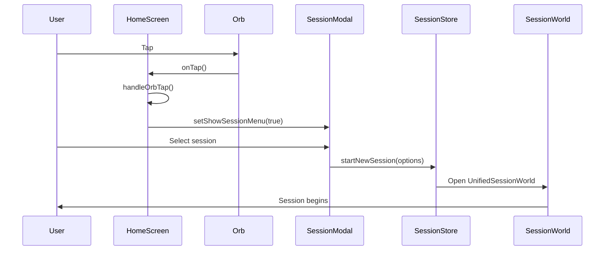
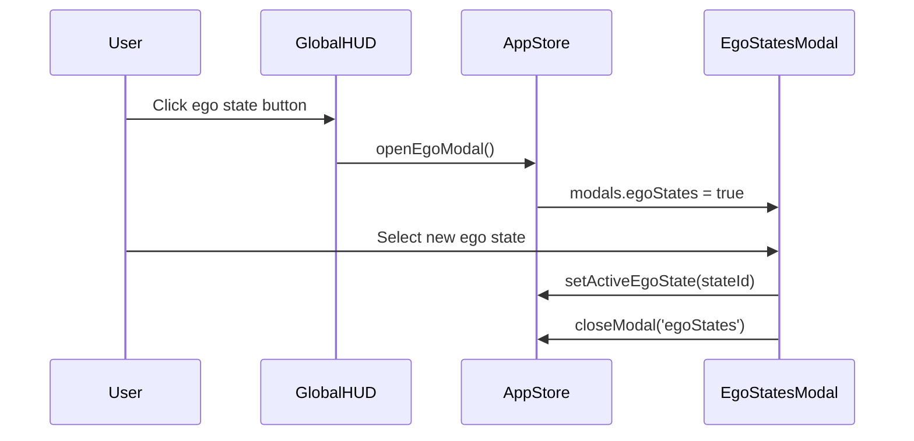

# Event Wiring: Libero Application Flow

This document maps the event flows and handlers throughout the Libero application.

## Critical Event Flows

### 1. Orb Tap → Session Start Flow



**Current Status**: ⚠️ Partially wired
- **Works**: Orb tap → Modal open
- **Missing**: Session completion → XP/token rewards
- **Fix needed**: Add session completion handler in `UnifiedSessionWorld.tsx`

### 2. HUD Ego State → Modal Flow



**Current Status**: ✅ Works
- **Handler**: `src/components/HUD/GlobalHUD.tsx:handleEgoStateClick`
- **Target**: `src/store/index.ts:openEgoModal`
- **Behavior**: Opens ego states modal correctly

## Event Handler Mapping

### Home Screen Events
| Event | Current Handler | Expected Target | Status | Fix Needed |
|-------|----------------|-----------------|--------|------------|
| Orb Tap | `handleOrbTap` → `setShowSessionMenu(true)` | Open session selection | ✅ Works | None |
| Quick Session | `handleQuickSessionTap` → `setShowSessionMenu(true)` | Open session selection | ✅ Works | None |
| Milestone Click | `handleMilestoneClick` → `setShowSessionMenu(true)` | Start specific session | ⚠️ Partial | Pass milestone data to session |
| Action Buttons | `onTabChange(tabId)` | Navigate to tab | ✅ Works | None |

### Session World Events
| Event | Current Handler | Expected Target | Status | Fix Needed |
|-------|----------------|-----------------|--------|------------|
| Play/Pause | `handlePlayPause` → `play()`/`pause()` | Control playback | ✅ Works | None |
| Skip Forward | `nextSegment` | Next segment | ✅ Works | None |
| Skip Back | `prevSegment` | Previous segment | ✅ Works | None |
| Session End | `sessionHandle.on('end')` | Reward user, close session | ❌ Missing | Add completion handler |
| Close Session | `handleClose` → `onClose()` | Return to home | ✅ Works | None |

### Create Screen Events
| Event | Current Handler | Expected Target | Status | Fix Needed |
|-------|----------------|-----------------|--------|------------|
| Step Navigation | `handleNext`/`handleBack` | Navigate wizard | ✅ Works | None |
| Protocol Creation | `handleComplete` | Save protocol, deduct tokens | ✅ Works | None |
| Token Check | Token validation in `handleComplete` | Prevent creation if insufficient | ✅ Works | None |

### Chat Screen Events
| Event | Current Handler | Expected Target | Status | Fix Needed |
|-------|----------------|-----------------|--------|------------|
| Send Message | `sendMessage` → API call | AI response | ⚠️ Partial | Requires OPENAI_API_KEY |
| Voice Recording | `startRecording`/`stopRecording` | Record audio | ✅ Works | None |
| Voice Transcription | `sendRecording` | Transcribe and send | ❌ Missing | Add Whisper API call |

### Modal Events
| Event | Current Handler | Expected Target | Status | Fix Needed |
|-------|----------------|-----------------|--------|------------|
| Plan Upgrade | `handleUpgrade` | Stripe checkout | ❌ Missing | Implement Stripe flow |
| Token Purchase | `handlePurchaseTokens` | Stripe checkout | ❌ Missing | Implement token packages |
| Settings Save | Various toggles | Persist settings | ❌ Missing | Add settings persistence |
| Protocol Delete | `handleProtocolDelete` | Remove from DB | ✅ Works | None |

## Missing Event Handlers

### 1. Session Completion Rewards
**Location**: `src/components/session/UnifiedSessionWorld.tsx`
**Missing Handler**: 
```typescript
const handleSessionComplete = async () => {
  // Award XP based on session duration/quality
  await addExperience(sessionXP);
  // Increment daily streak
  await incrementStreak();
  // Save session to database
  await saveSessionToDatabase(sessionData);
  // Show completion toast
  showToast({ type: 'success', message: 'Session completed! +XP +tokens' });
};
```

### 2. Stripe Checkout Integration
**Location**: `src/components/modals/PlanModal.tsx`
**Missing Handler**:
```typescript
const handleUpgrade = async () => {
  try {
    const { url } = await paymentService.createCheckoutSession('mystic-subscription');
    window.location.href = url;
  } catch (error) {
    showToast({ type: 'error', message: 'Checkout failed' });
  }
};
```

### 3. Settings Persistence
**Location**: `src/components/modals/SettingsModal.tsx`
**Missing Handler**:
```typescript
const handleSaveSettings = async () => {
  await updateUser({ 
    settings: { 
      voiceEnabled, 
      volume, 
      theme, 
      notifications 
    } 
  });
};
```

## Event Flow Validation

### ✅ Working Flows
- Authentication (sign in/up/out)
- Navigation between tabs
- Modal open/close
- Ego state selection
- Protocol creation with token deduction
- Basic session playback controls

### ⚠️ Partially Working Flows
- Session start → completion (missing rewards)
- AI chat (requires API key)
- Voice recording → transcription (missing Whisper)
- Settings changes (no persistence)

### ❌ Broken/Missing Flows
- Payment/upgrade flows
- Achievement unlocking
- Session history tracking
- Weekly challenge progression
- Real-time analytics updates