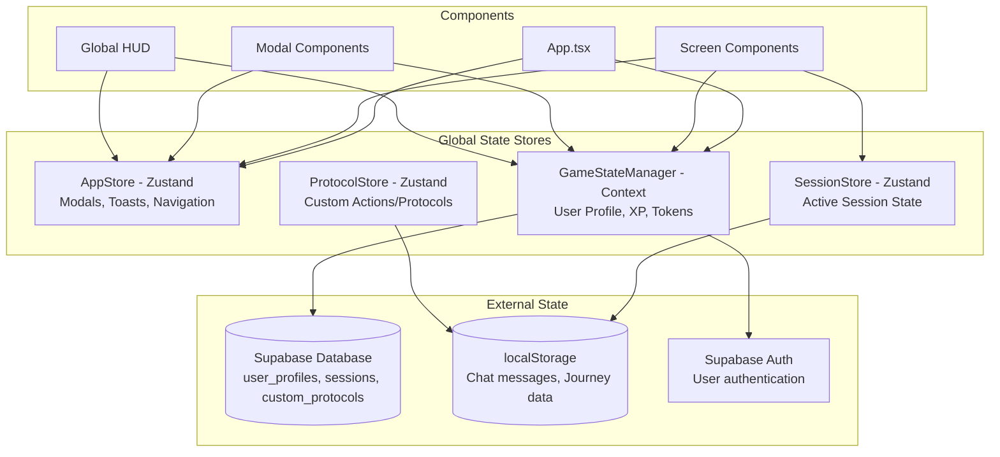
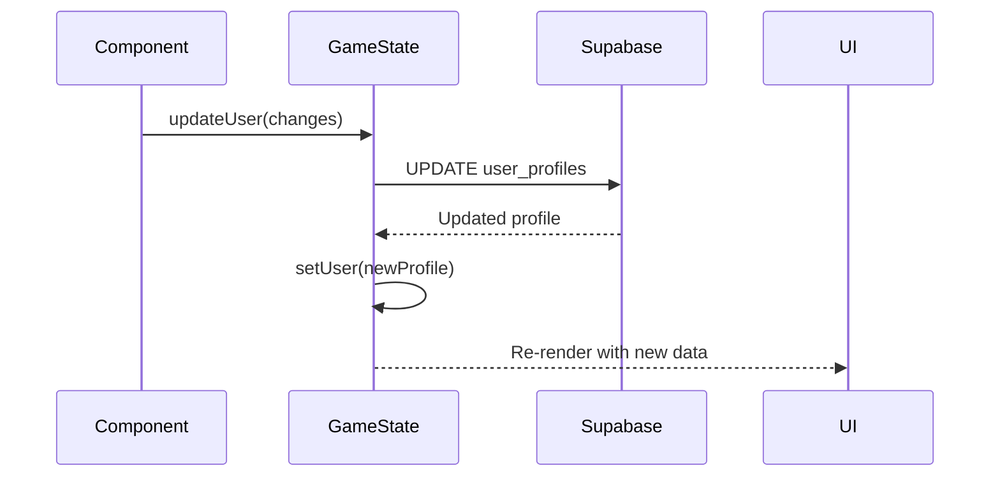
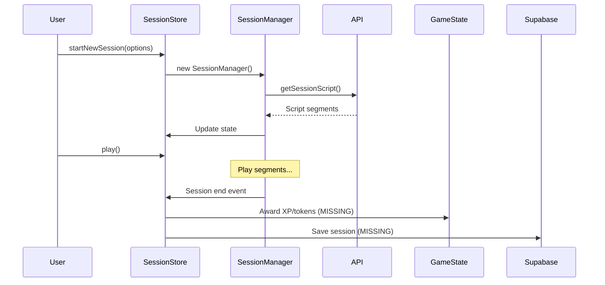
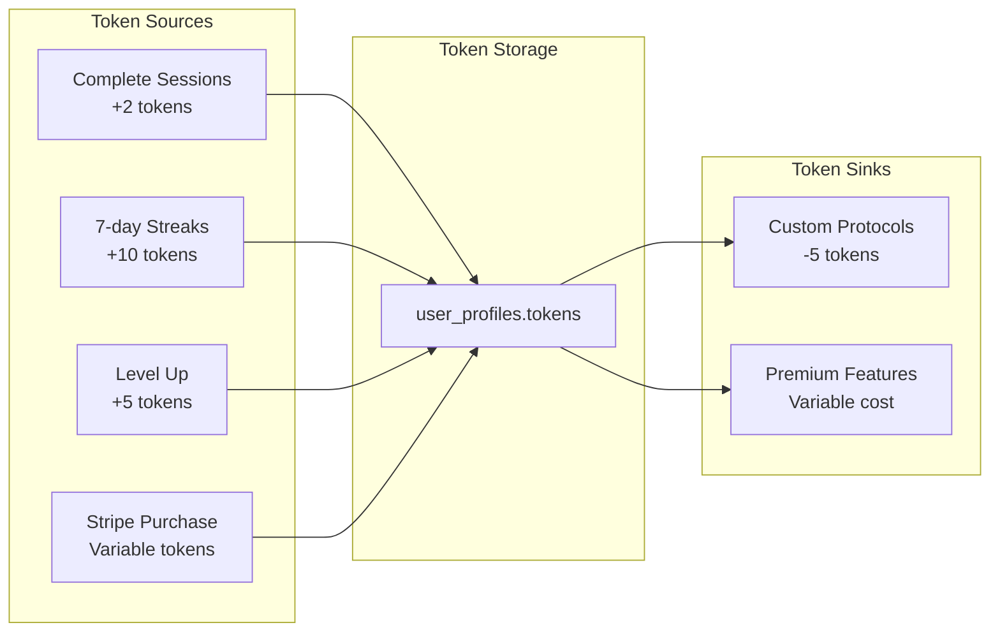

# State & Data Flow: Libero Application

This document diagrams the global state management, data flow, and identifies ownership responsibilities.

## Global State Architecture



## State Ownership Matrix

| Data Type | Owner | Source of Truth | Consumers | Persistence |
|-----------|-------|-----------------|-----------|-------------|
| **User Profile** | GameStateManager | `user_profiles` table | All screens, HUD, modals | Supabase |
| **Active Session** | SessionStore | In-memory | UnifiedSessionWorld, controls | None (ephemeral) |
| **Ego State** | AppStore | `activeEgoState` string | Orb, HUD, session components | User profile |
| **Tokens/XP/Level** | GameStateManager | `user_profiles` table | HUD, Profile, Create, modals | Supabase |
| **Modal States** | AppStore | `modals` object | All modal components | None (ephemeral) |
| **Navigation** | AppStore | `activeTab` string | NavigationTabs, App routing | None (ephemeral) |
| **Custom Protocols** | ProtocolStore + DB | `custom_protocols` table | Create screen, Personal Library | Supabase + localStorage |
| **Chat Messages** | Local state | localStorage | ChatScreen | localStorage |
| **Journey Data** | Local state | localStorage | JourneyMapScreen | localStorage |
| **Session History** | Database | `sessions` table | Favorites, Profile, Analytics | Supabase |

## Data Flow Patterns

### 1. User Profile Updates



**Current Status**: ✅ Working
**Files**: `src/components/GameStateManager.tsx`

### 2. Session Lifecycle



**Current Status**: ⚠️ Partially working
**Missing**: Session completion rewards and persistence

### 3. Token Economy Flow



**Current Status**: ⚠️ Partially implemented
- ✅ Token deduction for custom protocols
- ❌ Token rewards for sessions/streaks/levels
- ❌ Token purchase via Stripe

## State Duplication Issues

### 1. Ego State Storage
**Problem**: Ego state stored in both AppStore and user_profiles
**Files**: 
- `src/store/index.ts` (activeEgoState)
- `src/lib/supabase.ts` (user_profiles.active_ego_state)
**Fix**: Use user_profiles as source of truth, sync AppStore on load

### 2. Journey Data
**Problem**: Onboarding data stored in localStorage, not synced with user profile
**Files**:
- `src/components/journey/OnboardingWizard.tsx` (localStorage)
- `src/components/screens/JourneyMapScreen.tsx` (localStorage)
**Fix**: Create user_journey_data table or add fields to user_profiles

### 3. Chat Message Persistence
**Problem**: Chat messages only in localStorage, not associated with user profile
**Files**:
- `src/components/screens/ChatScreen.tsx` (localStorage)
**Fix**: Create chat_messages table for cross-device sync

## Dead State Identification

### Unused Props
1. **ProfileScreen**: `selectedEgoState` and `onEgoStateChange` props not used
2. **HomeScreen**: `selectedEgoState` and `onEgoStateChange` props not used
3. **App.tsx**: Hardcoded ego state props passed to ProfileScreen

### Unused State Variables
1. **Various modals**: Empty arrays for features, packages, etc.
2. **ProfileScreen**: `recentSessions` always empty array
3. **JourneyPath**: `celebratingMilestone` state never triggered

## Single Source of Truth Gaps

### 1. User Progress Data
**Current**: Mixed between GameStateManager and localStorage
**Should be**: All in user_profiles table with computed fields

### 2. Session Data
**Current**: No persistence after session ends
**Should be**: All sessions saved to sessions table

### 3. Protocol Data
**Current**: Mix of static data and database
**Should be**: All protocols in database with categories table

## Recommended State Consolidation

### 1. Centralize User Data
```typescript
// All user-related data should flow through GameStateManager
interface UserProfile {
  // Core profile
  id: string;
  email: string;
  level: number;
  experience: number;
  tokens: number;
  
  // Session data
  session_streak: number;
  daily_sessions_used: number;
  last_session_date: string;
  
  // Preferences
  active_ego_state: string;
  settings: UserSettings;
  
  // Journey data
  onboarding_completed: boolean;
  journey_goals: string[];
  journey_preferences: JourneyPreferences;
}
```

### 2. Session State Lifecycle
```typescript
// Clear session state lifecycle
interface SessionLifecycle {
  draft: SessionDraft;      // Before starting
  active: ActiveSession;    // During session
  completed: CompletedSession; // After session
}
```

### 3. Remove localStorage Dependencies
- Move chat messages to database
- Move journey data to user profile
- Keep only UI preferences in localStorage

## State Update Patterns

### Current Pattern (Working)
```typescript
// GameStateManager pattern
const { user, updateUser } = useGameState();
await updateUser({ tokens: user.tokens - 5 });
```

### Problematic Patterns
```typescript
// Direct Supabase calls (bypasses state management)
const { data } = await supabase.from('user_profiles').update(...);

// localStorage without state sync
localStorage.setItem('journey-data', JSON.stringify(data));
```

### Recommended Pattern
```typescript
// All updates through centralized managers
const { updateUserJourney } = useGameState();
await updateUserJourney(journeyData); // Handles both DB and state
```