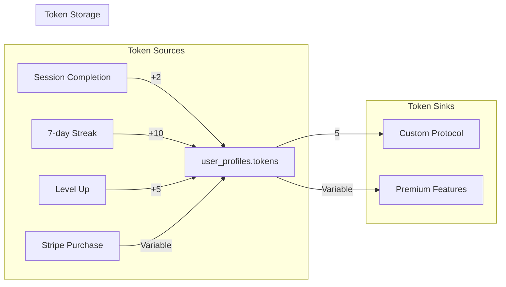

# Backend Integration Plan: Libero Application

This document outlines the current state and required integrations for all backend services.

## Supabase Database Integration

### Current Tables Status

| Table | Status | RLS Enabled | Used By | Missing Features |
|-------|--------|-------------|---------|------------------|
| `user_profiles` | ✅ Active | ✅ Yes | GameStateManager, all screens | Journey data fields |
| `sessions` | ⚠️ Partial | ✅ Yes | FavoritesModal | No writes from session completion |
| `custom_protocols` | ✅ Active | ✅ Yes | CreateScreen, PersonalLibrary | None |
| `stripe_customers` | ✅ Ready | ✅ Yes | Stripe webhooks | Not actively used |
| `stripe_subscriptions` | ✅ Ready | ✅ Yes | Stripe webhooks | Not actively used |
| `stripe_orders` | ✅ Ready | ✅ Yes | Stripe webhooks | Not actively used |

### Required Database Changes

#### 1. Add Journey Data to user_profiles
```sql
-- Add onboarding and journey tracking fields
ALTER TABLE user_profiles ADD COLUMN IF NOT EXISTS onboarding_completed BOOLEAN DEFAULT FALSE;
ALTER TABLE user_profiles ADD COLUMN IF NOT EXISTS journey_goals JSONB DEFAULT '[]'::jsonb;
ALTER TABLE user_profiles ADD COLUMN IF NOT EXISTS journey_preferences JSONB DEFAULT '{}'::jsonb;
ALTER TABLE user_profiles ADD COLUMN IF NOT EXISTS settings JSONB DEFAULT '{}'::jsonb;
```

#### 2. Create achievements table
```sql
CREATE TABLE IF NOT EXISTS user_achievements (
  id UUID PRIMARY KEY DEFAULT gen_random_uuid(),
  user_id UUID REFERENCES user_profiles(id) ON DELETE CASCADE,
  achievement_id TEXT NOT NULL,
  unlocked_at TIMESTAMPTZ DEFAULT NOW(),
  metadata JSONB DEFAULT '{}'::jsonb
);
```

### Client Integration Status

#### GameStateManager (`src/components/GameStateManager.tsx`)
- ✅ **Working**: Profile CRUD operations
- ✅ **Working**: Experience and level updates
- ✅ **Working**: Ego state usage tracking
- ❌ **Missing**: Journey data persistence
- ❌ **Missing**: Settings persistence
- ❌ **Missing**: Achievement tracking

#### Session Persistence
- ❌ **Missing**: Session completion not saved to `sessions` table
- **Required**: Add session save in `UnifiedSessionWorld.tsx`
```typescript
const saveSessionToDatabase = async (sessionData: any) => {
  await supabase.from('sessions').insert({
    user_id: user.id,
    ego_state: sessionData.egoState,
    action: sessionData.action,
    duration: sessionData.duration,
    experience_gained: sessionData.xpAwarded
  });
};
```

## Stripe Integration

### Current Implementation Status

#### Edge Functions
| Function | Status | Environment Variables | Purpose |
|----------|--------|----------------------|---------|
| `stripe-checkout` | ✅ Deployed | `STRIPE_SECRET_KEY` | Create checkout sessions |
| `stripe-webhook` | ✅ Deployed | `STRIPE_SECRET_KEY`, `STRIPE_WEBHOOK_SECRET` | Handle payment events |

#### Client Integration
| Component | Status | Implementation | Missing |
|-----------|--------|----------------|---------|
| `PaymentService` | ✅ Ready | `src/lib/stripe.ts` | None |
| `PlanModal` upgrade | ❌ Missing | Button exists | Stripe checkout call |
| `TokensModal` purchase | ❌ Missing | UI exists | Token package definitions |
| Payment success/cancel | ⚠️ Partial | Routes exist | Profile refresh after payment |

### Required Stripe Integration

#### 1. Plan Upgrade Flow
**File**: `src/components/modals/PlanModal.tsx`
```typescript
const handleUpgrade = async () => {
  try {
    setIsProcessingPayment(true);
    const { url } = await paymentService.createCheckoutSession('mystic-subscription');
    window.location.href = url;
  } catch (error) {
    showToast({ type: 'error', message: 'Upgrade failed' });
  } finally {
    setIsProcessingPayment(false);
  }
};
```

#### 2. Token Purchase Packages
**File**: `src/lib/stripe.ts`
```typescript
export const TOKEN_PACKAGES = {
  'tokens-small': { priceId: 'price_tokens_100', amount: 100, bonus: 10, price: '$4.99' },
  'tokens-medium': { priceId: 'price_tokens_250', amount: 250, bonus: 50, price: '$9.99' },
  'tokens-large': { priceId: 'price_tokens_500', amount: 500, bonus: 150, price: '$19.99' }
};
```

#### 3. Customer Portal Integration
**File**: `src/components/modals/SettingsModal.tsx`
```typescript
const handleOpenCustomerPortal = async () => {
  const { url } = await paymentService.createCustomerPortalSession();
  window.open(url, '_blank');
};
```

## AI Service Integration

### OpenAI ChatGPT Integration

#### Current Status
| Service | Edge Function | Status | Environment Variable | Purpose |
|---------|---------------|--------|---------------------|---------|
| Script Generation | `generate-script` | ⚠️ Partial | `OPENAI_API_KEY` | Create session scripts |
| Chat Responses | `chatgpt-chat` | ⚠️ Partial | `OPENAI_API_KEY` | Interactive chat |
| AI Hypnosis | `ai-hypnosis` | ⚠️ Partial | `OPENAI_API_KEY` | Session guidance |

#### Required Configuration
1. **Set OPENAI_API_KEY** in Supabase Edge Functions environment
2. **Test API quota** and rate limits
3. **Implement retry logic** for transient failures

#### Client Integration Points
| Component | API Call | Status | Fallback |
|-----------|----------|--------|----------|
| `SessionManager` | `getSessionScript()` | ⚠️ Partial | Emergency script |
| `ChatScreen` | `chatgpt-chat` function | ⚠️ Partial | Error message |
| `AIVoiceSystem` | `ai-hypnosis` function | ⚠️ Partial | Static responses |

### Text-to-Speech Integration

#### Current Status
| Service | Edge Function | Status | Environment Variable | Purpose |
|---------|---------------|--------|---------------------|---------|
| OpenAI TTS | `tts` | ⚠️ Partial | `OPENAI_API_KEY` | Voice synthesis |
| ElevenLabs TTS | `elevenlabs-tts-proxy` | ⚠️ Partial | `ELEVENLABS_API_KEY` | Premium voice |

#### Fallback Chain
1. **OpenAI TTS** (primary)
2. **ElevenLabs TTS** (premium fallback)
3. **Browser TTS** (always available)

#### Client Integration
**File**: `src/services/voice.ts`
- ✅ **Working**: Fallback to browser TTS
- ⚠️ **Partial**: API TTS requires key configuration
- ✅ **Working**: Audio caching system

## Tokenomics Implementation

### Current Token Flow



### Implementation Status

#### Token Sources
| Source | Status | Implementation | File |
|--------|--------|----------------|------|
| Session Completion | ❌ Missing | No session end handler | `UnifiedSessionWorld.tsx` |
| 7-day Streak | ❌ Missing | No streak reward logic | `GameStateManager.tsx` |
| Level Up | ❌ Missing | No level up rewards | `GameStateManager.tsx` |
| Stripe Purchase | ❌ Missing | No token package products | `stripe.ts` |

#### Token Sinks
| Sink | Status | Implementation | File |
|------|--------|----------------|------|
| Custom Protocol | ✅ Working | Token deduction implemented | `CreateScreen.tsx` |
| Premium Features | ❌ Missing | No premium token costs | Various |

### Required Token Implementation

#### 1. Session Completion Rewards
**File**: `src/components/session/UnifiedSessionWorld.tsx`
```typescript
const handleSessionEnd = async () => {
  const xpGained = calculateSessionXP(sessionData);
  const tokensGained = 2; // Base session reward
  
  await updateUser({
    experience: user.experience + xpGained,
    tokens: user.tokens + tokensGained
  });
  
  await incrementStreak(); // May award bonus tokens
};
```

#### 2. Streak Bonus System
**File**: `src/components/GameStateManager.tsx`
```typescript
const incrementStreak = async () => {
  const newStreak = user.session_streak + 1;
  let bonusTokens = 0;
  
  if (newStreak % 7 === 0) {
    bonusTokens = 10; // Weekly streak bonus
  }
  
  await updateUser({
    session_streak: newStreak,
    tokens: user.tokens + bonusTokens,
    last_session_date: today
  });
};
```

## Integration Gaps Summary

### High Priority
1. **Session Completion**: No rewards or persistence
2. **AI API Keys**: Required for core functionality
3. **Stripe Products**: No actual payment products defined
4. **Journey Data**: Not persisted to database

### Medium Priority
1. **Achievement System**: No tracking or unlocking
2. **Settings Persistence**: Changes not saved
3. **Voice Transcription**: Recorded messages not transcribed
4. **Analytics Data**: Limited real-time insights

### Low Priority
1. **Social Features**: No real comparison data
2. **Advanced AI Features**: Enhanced personalization
3. **Push Notifications**: Reminder system
4. **Offline Support**: Progressive Web App features

## Environment Variables Required

### Supabase Edge Functions
```bash
OPENAI_API_KEY=sk-...           # Required for AI features
ELEVENLABS_API_KEY=...          # Optional for premium TTS
STRIPE_SECRET_KEY=sk_...        # Required for payments
STRIPE_WEBHOOK_SECRET=whsec_... # Required for webhooks
```

### Client Environment
```bash
VITE_SUPABASE_URL=https://...   # ✅ Configured
VITE_SUPABASE_ANON_KEY=eyJ...   # ✅ Configured
VITE_ANALYTICS_ENDPOINT=...     # Optional for analytics
```

## API Call Audit

### Supabase Calls by Screen
| Screen | Reads | Writes | Status |
|--------|-------|--------|--------|
| GameStateManager | user_profiles | user_profiles | ✅ Working |
| CreateScreen | custom_protocols | custom_protocols | ✅ Working |
| FavoritesModal | sessions | sessions (delete) | ⚠️ Partial (no session writes) |
| PersonalLibrary | custom_protocols | custom_protocols (delete) | ✅ Working |
| ChatScreen | None | None | ✅ Working (localStorage) |

### Missing Database Writes
1. **Session completion** → `sessions` table
2. **Achievement unlocks** → `user_achievements` table  
3. **Journey data** → `user_profiles` or new table
4. **Settings changes** → `user_profiles.settings`

### Error Handling Status
- ✅ **Good**: All Supabase calls have error handling
- ✅ **Good**: Graceful fallbacks for API failures
- ⚠️ **Needs work**: Some error messages could be more user-friendly
- ✅ **Good**: Loading states implemented